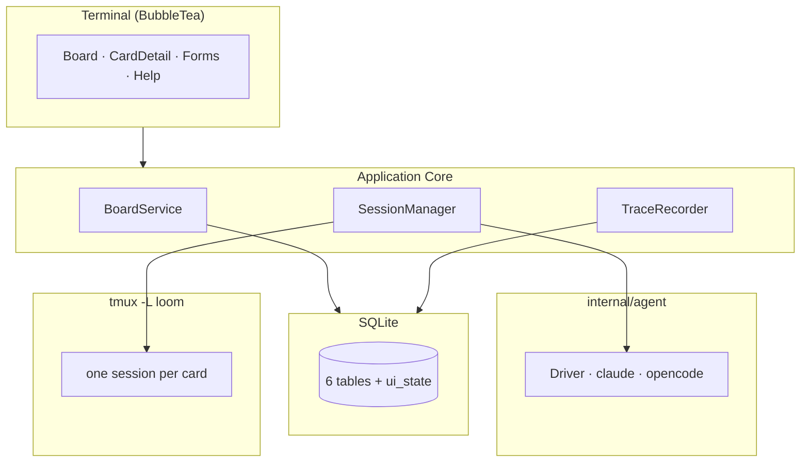

# Loom — Codebase Wiki

**Loom** is a CLI-native Kanban task tracker with agent launch. A single Go binary shows a Kanban board in the terminal; opening a card launches that card's coding agent (**claude** or **opencode**) inside a detached tmux session on a dedicated `-L loom` server. The human stays in the loop by attaching and detaching; the board stays usable while the agent works in the background, and every session's file changes are traced to the card.

This wiki describes the designed system. **The repo is now partially implemented**: the T1 [config package](./modules/config.md), the T2 [agent contract](./modules/agent.md) (driver interface, registry, prompt builder, quoting — `internal/agent`, module `loom`, go 1.23), the T3 [claude + opencode drivers](./modules/agent.md) (argv builders, `init()` registration), and the T4 [store migrations + pragmas](./modules/store.md) (`internal/store` — `Open`/`migrateUp`, the per-connection pragma hook, goose migrations `00001_initial.sql`/`00002_card_agent.sql`) plus the T5 [store kanban CRUD](./modules/store.md) (workspaces/boards/columns/codebases, `ui_state`, `loom init` — `NewID()`, `CreateWorkspace`/`CreateBoard`/`InitWorkspace`, single-row `SetUIState`) the T6 [store card CRUD + reorder](./modules/store.md) (`CreateCard`/`UpdateCard`/`MoveCard`/`DeleteCard`, anchored `(prev+next)/2` repositioning with a pre-write whole-column renumber), and the T7 [store traces lifecycle](./modules/store.md) (`StartRun`/`RecordChange`/`EndRun`/`OpenRuns`/`AbortRun`, store-owned `data_json` shapes) the T8 [trace reconcile layer](./modules/trace.md) (`SnapshotBaseline`/`Reconcile`/`Dedup`/`FilesChanged`, `internal/trace/git.go`) and the T9 [trace recorder + watcher](./modules/trace.md) (`Recorder` run lifecycle, fsnotify walk/event loop, `.loomignore` + built-in ignores — `internal/trace/recorder.go`/`watcher.go`/`ignore.go`) and the T10 [session tmux wrapper](./modules/session.md) (`Tmux` + `New` with the tmux ≥ 3.x gate and install hint, typed `tmuxError`/`MissingServer`, real-tmux tests on an isolated `-L loomselftest` server — `internal/session/tmux.go`) and the T11 [SessionManager](./modules/session.md) (`Ensure`/`Attach`/`Kill`/`Status`/`ReconcileOnStartup`, shared `completeRun` finalize, `Sessions` live-state listing — `internal/session/manager.go`) and the T12 [BoardService](./modules/board.md) (full-facade `Service{db, sess}` over store CRUD + the `sessionManager` seam, `ResolveSelection` fallback chain, done-stage auto-kill on move — `internal/board/service.go`) and the T13 [CLI router](./modules/cli.md) (stdlib-flag `Main`/`App` dispatch mirroring ADR-001 §6, workspace/board/column/init/config/status/version/help handlers, the lazy tmux proxy degrading `status` — `internal/cli/`, `cmd/loom/main.go`) the T14 [card commands](./modules/cli.md) (add/update/list/show/move/delete, `--agent` validation + `--agent=` NULL reset, done-stage kill on `move`, client-side list `--search` — `internal/cli/card.go`) and the T15 [session commands](./modules/cli.md) (`card open`/`card close`/`attach`/`sessions` — the first bool flag (`--detach`), pure-attach semantics, a `sessions` listing that reuses `status`'s renderer verbatim and degrades like it too — `internal/cli/session.go`) and the T16/T17 [TUI](./modules/tui.md) (the BubbleTea v2 board shell — canonical §3.5 keymap, five-column layout, navigation, quit confirm/force — plus live session control: per-card `cl`/`oc` agent badges, `●`/`◉` markers on a 2s poll, `Enter` to ensure + attach via `tea.ExecProcess`, `K` to kill + finalize — `internal/tui/app.go`/`keymap.go`/`board.go`, wired from bare `loom` on a TTY in `internal/cli/tui.go`) all ship as real Go source, and the T18 [TUI forms](./modules/tui.md) (the four overlays — `n` new card, `e` edit, `N` new column, `m` move — a single concrete `form` struct with text + in-place cycle fields, centered bordered box, create/edit/column/move routed through the widened Service seam with post-submit refocus; `internal/tui/forms.go`) and the T19 [TUI card detail pane](./modules/tui.md) (`d` — a centered overlay showing the focused card's metadata, resolved agent + codebase path, and its per-run history from the new `store.RunsForCard`, rendered via a tolerant plain-text markdown renderer; `internal/tui/card_detail.go`) ship too; only the TUI's search and board/workspace switch/help keys (T20) remain stubbed. The self-contained watcher/recorder tests run under the race detector. The canonical design lives in [ADR-001](../docs/ADR-001-loom-architecture.md) (architecture), [ADR-002](../docs/ADR-002-loom-multi-agent.md) (multi-agent support), and [DESIGN-002](../docs/DESIGN-002-loom-multi-agent.md) (implementation blueprint), with an execution backlog in [TASKS](../docs/TASKS-loom-v0.1.md). The wiki captures the same system as navigable, diagram-rich, cross-linked pages.

## What this is

- A **terminal-native** Kanban board (BubbleTea TUI) with full CLI/TUI parity for scripting.
- Opening a card **is** the launch: the card's context becomes the agent's prompt; the agent runs in a tmux session you can attach to or leave running.
- **User-driven**: no automated agents, no prompt injection, no lifecycle supervision — the human is always in control.
- Single binary, SQLite backend, external runtime deps limited to `tmux` + the user's coding agent.

## Architecture at a glance

Layered view: **Terminal (BubbleTea)** → **Application Core** (`BoardService`, `SessionManager`, `TraceRecorder`) → **SQLite store**, with the **agent layer** (`internal/agent`) producing the command that runs inside **tmux** sessions. See [Architecture Overview](./architecture/overview.md).

## Navigation

### Architecture

- [Overview](./architecture/overview.md) — layers, system boundaries, tech stack, key decisions
- [Session Model](./architecture/session-model.md) — the tmux lifecycle: probe, poll, reconcile-on-startup, attach/detach
- [Data Model](./architecture/data-model.md) — 6 domain tables + `ui_state`, IDs, ordering, pragmas, reorder strategy
- [Agent Abstraction](./architecture/agent-abstraction.md) — `AgentDriver` interface, claude/opencode drivers, launch semantics
- [Trace Recording](./architecture/trace-recording.md) — fsnotify watcher, ignore rules, git-baseline reconciliation

### Modules (Go packages — config, agent contract, claude/opencode drivers, store schema + kanban + card CRUD + trace run lifecycle + session tmux wrapper + SessionManager + BoardService + CLI router + card commands + session commands implemented, TUI shell + session markers (T16–T17), TUI forms (T18), TUI card detail (T19); TUI search + board/workspace switch/help (T20) planned per DESIGN-002 §4.2)

- [config](./modules/config.md) · [agent](./modules/agent.md) · [store](./modules/store.md) · [trace](./modules/trace.md) · [session](./modules/session.md) · [board](./modules/board.md) · [cli](./modules/cli.md) · [tui](./modules/tui.md)

### Flows

- [Card open → completion](./flows/card-open-complete.md) — the core loop
- [Attach/detach — human in the loop](./flows/attach-detach.md)
- [Trace reconciliation](./flows/trace-reconciliation.md) — file-change attribution
- [Failure paths](./flows/failure-paths.md) — the two ways a run is silently mis-recorded

### Concepts

- [run](./concepts/run.md) · [session](./concepts/session.md) · [stage](./concepts/stage.md) · [agent-driver](./concepts/agent-driver.md) · [watch-scope](./concepts/watch-scope.md) · [trace-events](./concepts/trace-events.md) · [git-reconciliation](./concepts/git-reconciliation.md)

### Guides

- [Add a new agent](./guides/add-a-new-agent.md) · [opencode launch semantics](./guides/opencode-launch-semantics.md) · [Change the schema](./guides/change-the-schema.md) · [Session command construction](./guides/session-command.md)

## Source documents

- [ADR-001 — Loom Architecture](../docs/ADR-001-loom-architecture.md) — canonical implementation details
- [ADR-002 — Multi-Agent Support](../docs/ADR-002-loom-multi-agent.md) — opencode as a second agent
- [DESIGN-002 — Implementation Blueprint](../docs/DESIGN-002-loom-multi-agent.md) — ready-for-implementation spec
- [RESEARCH — Detailed Design](../docs/RESEARCH-loom-detailed-design.md) — rationale (superseded for details by ADR-001)
- [PROBE — Full-TUI auto-submit](../docs/PROBE-full-tui.md) — Phase 0 probe transcript
- [TASKS — v0.1 Backlog](../docs/TASKS-loom-v0.1.md) — feature-dev implementation backlog

## Freshness

Generated 2026-08-09 against `source_commit: adcc17df`; refreshed 2026-08-09 against `source_commit: 724b0dd` (T1 config package), `e2ebff6` (T2 agent contract), `f729599` (T3 claude + opencode drivers), and `4fdc915` (T4 store migrations + pragmas), and `a390749` (T5 store kanban CRUD), and `9cc976a` (T6 store cards CRUD + reorder), and `6053c96` (T7 store traces run lifecycle), `2d2b56d` (T8 trace reconcile git baseline), and `b0b428e` (T9 trace recorder + watcher), and `c8a36d1` (T10 tmux client wrapper), and `1e545f4` (T11 SessionManager), and `b156ea6` (T12 BoardService), and `d543251` (T13 CLI router); refreshed 2026-08-11 against `source_commit: 1eee0fe` (T16 board TUI shell + T17 session markers/badges/open/kill) and `8fd9dcc` (T18 TUI forms: new/edit card, new column, move picker) and `5b99765` (T19 TUI card detail pane: run history + metadata). See [log](./log.md) for the audit trail.
