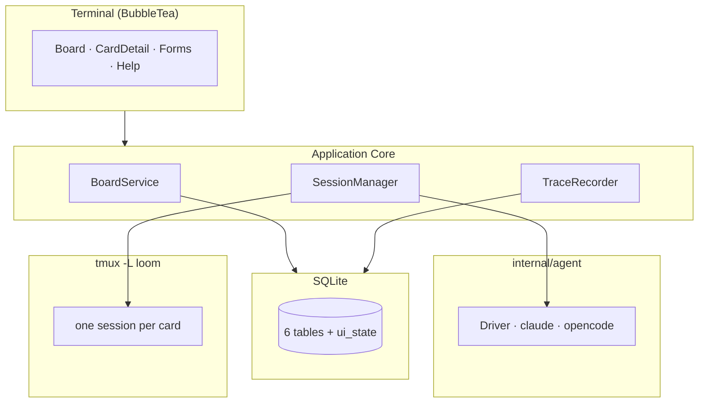

# Loom — Codebase Wiki

**Loom** is a CLI-native Kanban task tracker with agent launch. A single Go binary shows a Kanban board in the terminal; opening a card launches that card's coding agent (**claude** or **opencode**) inside a detached tmux session on a dedicated `-L loom` server. The human stays in the loop by attaching and detaching; the board stays usable while the agent works in the background, and every session's file changes are traced to the card.

This wiki describes the designed system. **The repo is now partially implemented**: the T1 [config package](./modules/config.md), the T2 [agent contract](./modules/agent.md) (driver interface, registry, prompt builder, quoting — `internal/agent`, module `loom`, go 1.23), the T3 [claude + opencode drivers](./modules/agent.md) (argv builders, `init()` registration), and the T4 [store migrations + pragmas](./modules/store.md) (`internal/store` — `Open`/`migrateUp`, the per-connection pragma hook, goose migrations `00001_initial.sql`/`00002_card_agent.sql`) ship as real Go source; the store's CRUD, session, TUI, and CLI are still design. The canonical design lives in [ADR-001](../docs/ADR-001-loom-architecture.md) (architecture), [ADR-002](../docs/ADR-002-loom-multi-agent.md) (multi-agent support), and [DESIGN-002](../docs/DESIGN-002-loom-multi-agent.md) (implementation blueprint), with an execution backlog in [TASKS](../docs/TASKS-loom-v0.1.md). The wiki captures the same system as navigable, diagram-rich, cross-linked pages.

## What this is

- A **terminal-native** Kanban board (BubbleTea TUI) with full CLI/TUI parity for scripting.
- Opening a card **is** the launch: the card's context becomes the agent's prompt; the agent runs in a tmux session you can attach to or leave running.
- **User-driven**: no automated agents, no prompt injection, no lifecycle supervision — the human is always in control.
- Single binary, SQLite backend, external runtime deps limited to `tmux` + the user's coding agent.

## Architecture at a glance

Layered view: **Terminal (BubbleTea)** → **Application Core** (`BoardService`, `SessionManager`, `TraceRecorder`) → **SQLite store**, with the **agent layer** (`internal/agent`) producing the command that runs inside **tmux** sessions. See [Architecture Overview](./architecture/overview.md).

## Navigation

### Architecture

- [Overview](./architecture/overview.md) — layers, system boundaries, tech stack, key decisions
- [Session Model](./architecture/session-model.md) — the tmux lifecycle: probe, poll, reconcile-on-startup, attach/detach
- [Data Model](./architecture/data-model.md) — 6 domain tables + `ui_state`, IDs, ordering, pragmas, reorder strategy
- [Agent Abstraction](./architecture/agent-abstraction.md) — `AgentDriver` interface, claude/opencode drivers, launch semantics
- [Trace Recording](./architecture/trace-recording.md) — fsnotify watcher, ignore rules, git-baseline reconciliation

### Modules (Go packages — config, agent contract, claude/opencode drivers, store migrations + pragmas implemented, rest planned per DESIGN-002 §4.2)

- [config](./modules/config.md) · [agent](./modules/agent.md) · [store](./modules/store.md) · [trace](./modules/trace.md) · [session](./modules/session.md) · [board](./modules/board.md) · [cli](./modules/cli.md) · [tui](./modules/tui.md)

### Flows

- [Card open → completion](./flows/card-open-complete.md) — the core loop
- [Attach/detach — human in the loop](./flows/attach-detach.md)
- [Trace reconciliation](./flows/trace-reconciliation.md) — file-change attribution
- [Failure paths](./flows/failure-paths.md) — the two ways a run is silently mis-recorded

### Concepts

- [run](./concepts/run.md) · [session](./concepts/session.md) · [stage](./concepts/stage.md) · [agent-driver](./concepts/agent-driver.md) · [watch-scope](./concepts/watch-scope.md) · [trace-events](./concepts/trace-events.md) · [git-reconciliation](./concepts/git-reconciliation.md)

### Guides

- [Add a new agent](./guides/add-a-new-agent.md) · [opencode launch semantics](./guides/opencode-launch-semantics.md) · [Change the schema](./guides/change-the-schema.md) · [Session command construction](./guides/session-command.md)

## Source documents

- [ADR-001 — Loom Architecture](../docs/ADR-001-loom-architecture.md) — canonical implementation details
- [ADR-002 — Multi-Agent Support](../docs/ADR-002-loom-multi-agent.md) — opencode as a second agent
- [DESIGN-002 — Implementation Blueprint](../docs/DESIGN-002-loom-multi-agent.md) — ready-for-implementation spec
- [RESEARCH — Detailed Design](../docs/RESEARCH-loom-detailed-design.md) — rationale (superseded for details by ADR-001)
- [PROBE — Full-TUI auto-submit](../docs/PROBE-full-tui.md) — Phase 0 probe transcript
- [TASKS — v0.1 Backlog](../docs/TASKS-loom-v0.1.md) — feature-dev implementation backlog

## Freshness

Generated 2026-08-09 against `source_commit: adcc17df`; refreshed 2026-08-09 against `source_commit: 724b0dd` (T1 config package), `e2ebff6` (T2 agent contract), `f729599` (T3 claude + opencode drivers), and `4fdc915` (T4 store migrations + pragmas). See [log](./log.md) for the audit trail.
