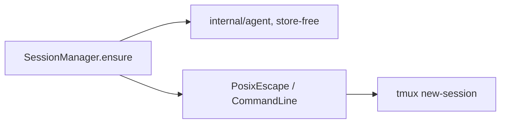

## Summary

ADR-002 generalizes the agent layer: a card (or, by default, the whole board) runs its agent as either `claude` or `opencode`, with the **identical** tmux lifecycle, completion detection, file-change tracing, and attach/detach — no change to the data-flow core. An `AgentDriver` interface produces the argv that runs inside the session; everything above it is agent-agnostic. Spec: ADR-002 §3–§5; refined in DESIGN-002 §5–§9.

## Diagram

## Key components

- **`Driver` interface** — `Name() string`, `Resolve(cfg *config.Config) (string, error)` (absolute path via `exec.LookPath` in loom's env), `LaunchMode() LaunchMode`, `Launch(exe string, card Card, cfg *config.Config) (SessionSpec, error)`. Two signature corrections over the ADR-as-drawn: `Resolve` takes cfg (binary is per-agent config), `Launch` takes `exe` (avoids a double `LookPath`) — DESIGN-002 §5.2.
- **`SessionSpec`** — `{ Argv []string; SendKeys string }`. `SendKeys` is an optional tmux key name sent **after** the probe passes (default `""` for both shipped drivers — opencode's `--prompt` auto-submits, verified).
- **Registry** — static map; `Get(name)`, `Known()`, `IsKnown(name)`. No dynamic registration in v0.1.x; both shipped drivers self-register via `init()` in their own files (T3), leaving the map literal in `driver.go` untouched.
- **`claudeDriver`** — argv `[abs-claude, context]` (positional prompt), optional `--model` after the prompt. `LaunchModeInteractive`. This is ADR-001's behavior moved behind the driver, unchanged. **Implemented (T3).**
- **`opencodeDriver`** — `interface = "mini"` (default) → `[abs-opencode, --mini, --prompt, ctx]`; `interface = "full"` → `[abs-opencode, --prompt, ctx]`. Pass-throughs appended after the prompt only when set: `model` → `--model`, `opencode_agent` → `--agent`, `auto_approve` → `--auto`. `LaunchModeInteractive`. **Implemented (T3).**
- **`agent.Card` projection** — `agent` stays store-free; `session` maps `store.Card` → `agent.Card` with the agent already resolved via `Card.AgentOrDefault(cfg)` (NULL → `[agent] default`, late-bound at launch time — DESIGN-002 §6).
- **`agent.Validate(cfg)`** — cross-package check that `Agent.Default` is a known agent, called from `main` at startup. Lives in `agent` (which imports `config`) to avoid the `config → agent` cycle (C8).

## Design decisions

| Decision | Rationale | Source |
|---|---|---|
| Driver interface (option A) | Clean N-agent extension, per-driver test isolation; loom owns the launch contract instead of delegating it | ADR-002 §2.3, DESIGN-002 §4.4 |
| Reject launcher-script option (C) | Every user script would have to re-implement loom's failure-path handling; violates single-binary | ADR-002 §2.3 |
| Per-card `agent` column with global default | A card remembers its agent; NULL falls back to `[agent] default`; late-bound at launch | ADR-002 §2.1, §6 |
| Only interactive launch ships | `opencode run` autonomous mode is designed (`LaunchMode: Run`) but not wired — consistent with Simplicity over automation | ADR-002 §2.1, §9 |
| `--prompt` auto-submit (SendKeys empty) | Empirically verified 2026-08-09 (probes P1/P2/P7/P8); the `SendKeys` field absorbs a future prefill-only regression | DESIGN-002 §3.2, §9.2 |

## Related

- [Architecture Overview](./overview.md) · [Session Model](./session-model.md) · [Data Model](./data-model.md)
- Concepts: [agent-driver](../concepts/agent-driver.md) · [session](../concepts/session.md)
- Flows: [Card open → completion](../flows/card-open-complete.md) · [Failure paths](../flows/failure-paths.md)
- Guides: [Add a new agent](../guides/add-a-new-agent.md)
