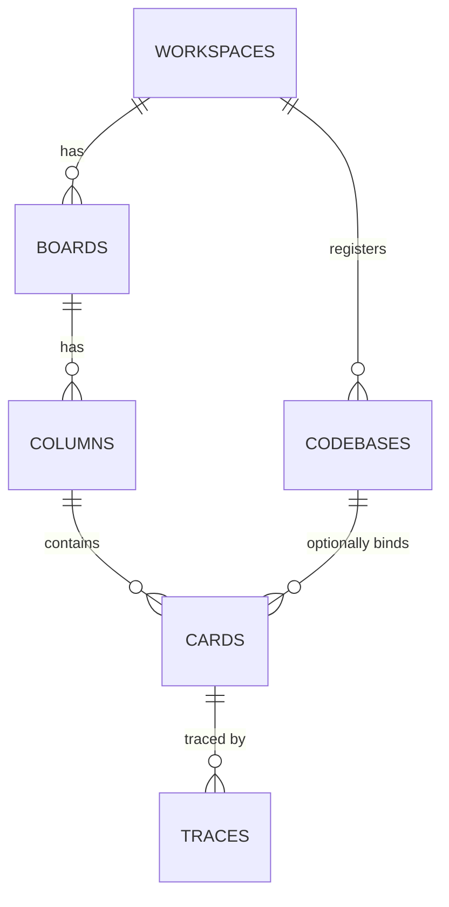

## Summary

Loom persists to a single SQLite database (`modernc.org/sqlite`, pure Go, no CGO) with **6 domain tables** (`workspaces`, `boards`, `columns`, `codebases`, `cards`, `traces`) plus a single-row `ui_state` table. Full DDL in ADR-001 §3.3. `notes`/`artifacts` were cut from v0.1 and return in v0.2 (ADR-001 §9). The schema ships as real Go source since T4 — `internal/store/migrate/00001_initial.sql` (+ `00002_card_agent.sql`), enforced by `internal/store`'s per-connection pragma hook (ADR-001 §2.2, §3.3); the CRUD layer on top is planned (T5–T7).

## Diagram

## Key components

- **workspaces** — project context: name, `root_path`, `archived_at`. Ordering by `created_at`.
- **boards** — a Kanban board within a workspace; `position` orders boards; cascade-deletes columns/cards.
- **columns** — a lane with a `stage` (`backlog|todo|dev|review|done`) that carries **real behavior**: moving a card into a `done`-stage column auto-kills the session and finalizes the trace (ADR-001 §3.3, §4.1). See [stage](../concepts/stage.md).
- **codebases** — registered project directories; `UNIQUE(workspace_id, path)`; selects a card's session cwd and watch scope.
- **cards** — the task: title, description, objective, acceptance_criteria, priority (`low|medium|high`), labels (comma-separated), denormalized `board_id`/`workspace_id`, nullable `codebase_id`, and nullable `agent` (ADR-002 migration). No `status` column — workflow state is the column. See [Agent Abstraction](./agent-abstraction.md) and [watch-scope](../concepts/watch-scope.md).
- **traces** — the file-change event stream; keyed by a monotonic `seq`. See [Trace Recording](./trace-recording.md) and [trace-events](../concepts/trace-events.md).
- **ui_state** — single-row table (`CHECK (id = 1)`) holding `last_workspace_id`/`last_board_id` — runtime selection state, **never** written to the user's `config.toml` (ADR-001 §5).

## Design decisions

| Decision | Rationale |
|---|---|
| 16 random bytes (`crypto/rand`), hex-encoded (32 hex chars) for IDs | Collision-safe and opaque, no `google/uuid` dep; no ordering property | ADR-001 §3.3 |
| `traces.seq INTEGER PRIMARY KEY AUTOINCREMENT` as sole ordering key | Timestamps tie within a millisecond on consecutive inserts; `AUTOINCREMENT` survives `VACUUM` (a bare rowid would be renumbered) | ADR-001 §3.3 |
| `strftime('%Y-%m-%dT%H:%M:%f','now')` timestamps | Millisecond precision for display/duration only — ordering is `seq`'s job | ADR-001 §3.3 |
| Per-connection pragmas: WAL · `foreign_keys=ON` · `busy_timeout=5000` · `synchronous=NORMAL` | `foreign_keys` is OFF by default — without it every `ON DELETE CASCADE` is inert | ADR-001 §3.3 |
| DDL ordered so every `REFERENCES` target exists first | `foreign_keys=ON` + goose would fail a forward reference | ADR-001 §3.3 |
| Card position: new `+1000`, move `(prev+next)/2`, rebalance when `next - prev <= 1` | Gap-based reorder; pre-write renumber (not post-hoc duplicate repair); O(n) only when a gap runs out | ADR-001 §3.4 |
| Runtime selection state in `ui_state`, not `config.toml` | loom never rewrites a hand-edited TOML; concurrent invocations can't clobber each other | ADR-001 §5 |

## Related

- [Architecture Overview](./overview.md) · [Trace Recording](./trace-recording.md) · [Agent Abstraction](./agent-abstraction.md)
- Concepts: [run](../concepts/run.md) · [trace-events](../concepts/trace-events.md) · [stage](../concepts/stage.md) · [watch-scope](../concepts/watch-scope.md)
- Guides: [Change the schema](../guides/change-the-schema.md)
