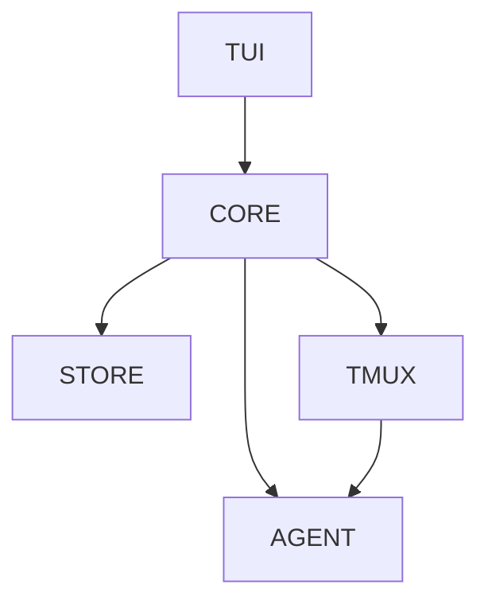

## Summary

Loom is a **CLI-native Kanban task tracker with agent launch**: a single Go binary that shows a Kanban board in the terminal, and opening a card launches that card's coding agent (Claude Code or opencode) inside a detached tmux session on a dedicated `-L loom` server. The human stays in the loop by attaching and detaching; the board stays usable while the agent works in the background. The canonical design is [ADR-001](../../docs/ADR-001-loom-architecture.md), extended for multiple agents by [ADR-002](../../docs/ADR-002-loom-multi-agent.md) and the [implementation blueprint](../../docs/DESIGN-002-loom-multi-agent.md). The repo is **partially implemented**: the T1 [config](../modules/config.md) package is real Go source; the remainder is still design — the wiki describes the designed system.

## Diagram

## Key components

- **Terminal tier** — BubbleTea v2 TUI with board, card-detail, forms, and help views. Canonical keybindings in ADR-001 §3.5 (board render model from [kancli](../../docs/ADR-001-loom-architecture.md)).
- **Application Core** — three services: `BoardService` (kanban CRUD + card movement), `SessionManager` (the tmux lifecycle), `TraceRecorder` (file-change events).
- **Agent layer** — `AgentDriver` interface with two implementations (`claude`, `opencode`); produces the argv that runs inside the session. See [Agent Abstraction](./agent-abstraction.md).
- **tmux substrate** — the dedicated `-L loom` server owns the PTY, signals, and child cleanup; loom never parents the agent process. See [Session Model](./session-model.md).
- **SQLite store** — `modernc.org/sqlite` (pure Go, no CGO), WAL mode, `foreign_keys=ON`, goose migrations. See [Data Model](./data-model.md).

## Design decisions

| Decision | Rationale | Source |
|---|---|---|
| Go + BubbleTea | Best terminal-UI ecosystem in any language; Rust/Ratatui and Python/Textual rejected (ecosystem depth, single binary) | ADR-001 §2.1 |
| tmux session model (not `tea.ExecProcess` pop-over) | Human in the loop by attach/detach; sessions survive loom; N concurrent cards; tmux owns cleanup | ADR-001 §2.3 |
| Single binary | SQLite direct, no HTTP/SSE/React/Vite/CORS; external deps limited to `tmux` + the user's agent | ADR-001 §1.3 |
| Simplicity over automation | User drives the workflow; no automated agents, no lifecycle supervision; interactive launch is the only shipped mode | ADR-001 §1.3, ADR-002 §1.3 |
| Driver interface for agents | Clean N-agent extension, per-driver test isolation; loom owns the launch contract (path resolution, quoting, probe) | ADR-002 §2.3, DESIGN-002 §4.4 |

## Related

- [Session Model](./session-model.md) · [Data Model](./data-model.md) · [Agent Abstraction](./agent-abstraction.md) · [Trace Recording](./trace-recording.md)
- Concepts: [run](../concepts/run.md) · [session](../concepts/session.md) · [stage](../concepts/stage.md) · [watch-scope](../concepts/watch-scope.md)
- Flow: [Card open → completion](../flows/card-open-complete.md)
