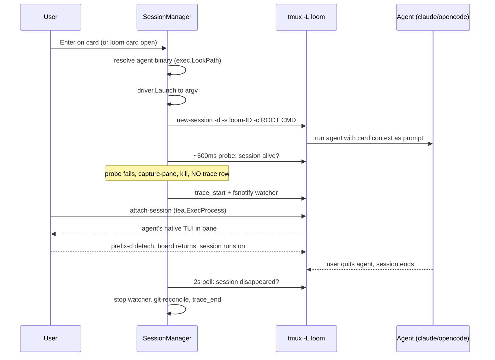

## Summary

Every card maps to a **persistent tmux session** on a dedicated `-L loom` server. The agent runs as the session's command; the human attaches to watch/steer and detaches to let it run. **Loom never parents the agent process** — tmux owns the PTY, signal routing, and child cleanup, so `session exists == agent running`. Details in ADR-001 §2.3 and §4.

## Diagram

## Key components

- **`SessionManager.ensure`** — create-or-reuse the card's session; the only lifecycle method that touches the driver (DESIGN-002 §10.2). The run is **recorded after the probe passes**, and any session it created is killed on every post-creation error path.
- **Startup probe** — ~500ms re-check that `loom-<id>` still exists; a session already gone means the command never launched (bad binary, bad cwd). The `trace_start` row is **deleted, never finalized** (ADR-001 §4.1 step 1; DESIGN-002 §10.2 invariant 2).
- **2s poll** — `tmux -L loom list-sessions` drives per-card running / attached markers. This is a liveness *indicator*, not the completion guarantee.
- **Reconcile-on-startup** — on every startup, runs with a `trace_start` and no `trace_end` whose session is absent are finalized. This is the correctness backstop for runs that end between polls or while loom is not running (ADR-001 §4.1 step 5).
- **tmux client wrapper** (`session/tmux.go`) — thin, testable wrapper: `NewSession`, `HasSession`, `CapturePane`, `SendKeys`, `KillSession`, `ListSessions` (DESIGN-002 §10.1).

## Design decisions

| Decision | Rationale |
|---|---|
| Dedicated `-L loom` server | Private socket; never collides with the user's own tmux; `exit-empty on` so the server exits when its last session ends | ADR-001 §4.4 |
| Session name `loom-<cardid>` | Full 32-hex card id is unique and self-describing; colons are forbidden in tmux names | ADR-001 §4.4 |
| `prefix C-a` via loom-owned tmux.conf | Nested-tmux safety when loom itself runs inside tmux | ADR-001 §4.4 |
| Attach via `tea.ExecProcess(tmux attach-session)` | The lazygit-pattern full-terminal handoff; the child is the tmux client, not the agent | ADR-001 §2.3, §4.1 step 2 |
| Record run after probe | A failed launch writes no trace row; no concurrent reconcile can finalize it (C7) | DESIGN-002 §10.2 |
| Reject board-as-tmux-layout | Intrusive and zellij-incompatible; deferred to v0.3 | ADR-001 §2.3 |

## Related

- [Architecture Overview](./overview.md) · [Trace Recording](./trace-recording.md) · [Agent Abstraction](./agent-abstraction.md)
- Concepts: [session](../concepts/session.md) · [run](../concepts/run.md) · [stage](../concepts/stage.md)
- Flows: [Card open → completion](../flows/card-open-complete.md) · [Attach/detach](../flows/attach-detach.md) · [Failure paths](../flows/failure-paths.md)
