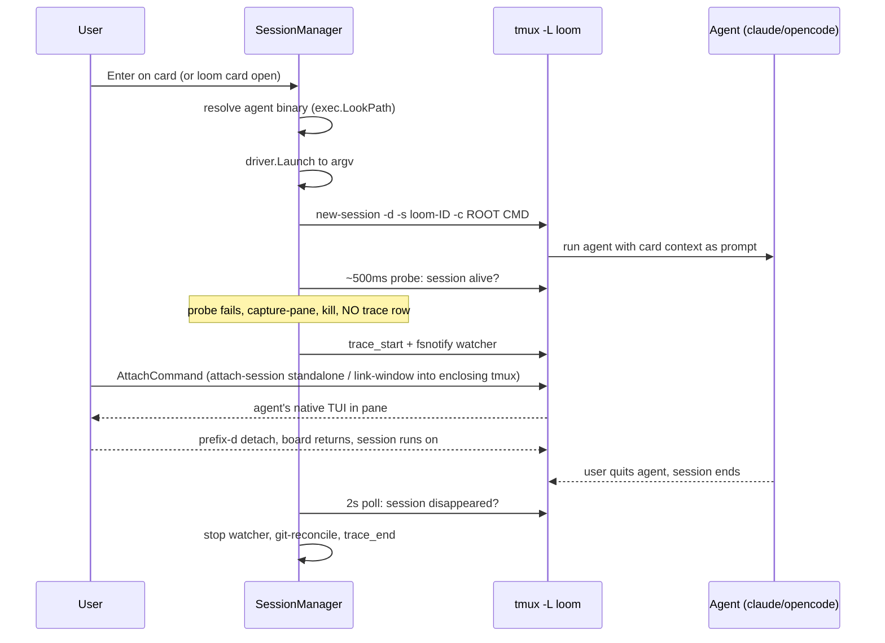

## Summary

Every card maps to a **persistent tmux session** hosting its agent. Standalone, sessions live on a dedicated `-L loom` server; when loom itself runs inside a tmux client (`$TMUX` set), sessions are created and managed on that **enclosing server** (`-S <socket>`) so a card opens as a plain linked window — a normal tab — rather than a nested tmux client. In both modes the agent runs as the session's command; the human attaches to watch/steer and detaches to let it run. **Loom never parents the agent process** — tmux owns the PTY, signal routing, and child cleanup, so `session exists == agent running`. Details in ADR-001 §2.3 and §4.

## Diagram

## Key components

- **`SessionManager.Ensure`** — create-or-reuse the card's session; the only lifecycle method that touches the driver (DESIGN-002 §10.2). The run is **recorded after the probe passes**, and any session it created is killed on every post-creation error path. **Implemented (T11).**
- **`completeRun`** — the single shared finalize path (used by `Status`, `Kill`, `ReconcileOnStartup`): git-reconcile the run against its stored baseline, emit missing `file_change` rows, write `trace_end` with `files_changed = unique(live ∪ missing)`. Startup-reconciled runs record `durationMs=0` (no start timestamp).
- **Startup probe** — ~500ms re-check that `loom-<id>` still exists; a session already gone means the command never launched (bad binary, bad cwd). The `trace_start` row is **deleted, never finalized** (ADR-001 §4.1 step 1; DESIGN-002 §10.2 invariant 2).
- **2s poll** — `tmux -L loom list-sessions` drives per-card running / attached markers. This is a liveness *indicator*, not the completion guarantee. **Implemented (T11)** as one synchronous `Status` tick (`Sessions` → `SessionStatus{Running, Attached}`); the caller owns cadence (TUI 2s poll, one-shot CLI).
- **Reconcile-on-startup** — on every startup, runs with a `trace_start` and no `trace_end` whose session is absent are finalized. This is the correctness backstop for runs that end between polls or while loom is not running (ADR-001 §4.1 step 5). **Implemented (T11)**; reconciled runs record `durationMs=0`.
- **tmux client wrapper** (`session/tmux.go`) — thin, testable wrapper: `NewSession`, `HasSession`, `CapturePane`, `SendKeys`, `KillSession`, `ListSessions`, `Sessions` (DESIGN-002 §10.1). **Implemented (T10 + T11):** `New(server)` resolves the binary once and gates tmux ≥ 3.x with an install hint; every failure surfaces as a typed `tmuxError`, and `MissingServer` flags the cold/missing-server state. `Sessions` (T11) lists live sessions with their attached flag via one `-F '#{session_name}\t#{session_attached}'` call for the `Status` markers. Since the b22a5a4 stamp the wrapper also owns the **enclosing-server model** (T23): `New` captures `$TMUX` (`EnclosingSocket`, the socket path) and `$TMUX_PANE`, every tmux subcommand is targeted by `targetArgs` (`-S <socket>` when enclosing, else `-L <server>`), `configureServer` applies the loom-owned settings (`prefix`, `status off`, `detach-on-destroy off`) on the dedicated `-L` server only (never the user's own tmux globals), `NewSession` names the first window (`-n`) so a linked tab is labelled `loom-<id>`, and `AttachCommand`/`AttachCommandFor` build the handoff — `link-window` into the enclosing session (or `select-window` when already linked) versus `attach-session` standalone.

## Design decisions

| Decision | Rationale |
|---|---|
| Dedicated `-L loom` server (standalone) | Private socket; never collides with the user's own tmux; `exit-empty on` so the server exits when its last session ends. Superseded by the enclosing server when loom runs inside tmux | ADR-001 §4.4 |
| Session name `loom-<cardid>` | Full 32-hex card id is unique and self-describing; colons are forbidden in tmux names | ADR-001 §4.4 |
| `prefix C-a` via `configureServer` | Nested-tmux safety when loom itself runs inside tmux: the loom-owned settings (`prefix`, `status off`, `detach-on-destroy off`) are applied as globals on the dedicated `-L` server only, never the user's own tmux | ADR-001 §4.4 |
| Attach via `tea.ExecProcess(AttachCommand)` | The lazygit-pattern full-terminal handoff; the child is the tmux client, not the agent. `AttachCommand` selects the server: `link-window`/`select-window` on the enclosing server, `attach-session` standalone | ADR-001 §2.3, §4.1 step 2 |
| Record run after probe | A failed launch writes no trace row; no concurrent reconcile can finalize it (C7) | DESIGN-002 §10.2 |
| Enclosing-server tab model | When loom runs inside the user's tmux, manage sessions on that server (`-S`) and open a card via `link-window` as a plain tab — never a nested tmux client; standalone keeps the dedicated `-L` socket | commit 83c4e44 / ee737ab |
| Kill via `kill-window` when linked | A linked window outlives `kill-session`; killing the window destroys the pane/agent across every link, which empties and destroys the session too (with a `kill-session` fallback) | commit 83c4e44 |
| Reject board-as-tmux-layout | Intrusive and zellij-incompatible; deferred to v0.3 | ADR-001 §2.3 |

## Related

- [Architecture Overview](./overview.md) · [Trace Recording](./trace-recording.md) · [Agent Abstraction](./agent-abstraction.md)
- Concepts: [session](../concepts/session.md) · [run](../concepts/run.md) · [stage](../concepts/stage.md)
- Flows: [Card open → completion](../flows/card-open-complete.md) · [Attach/detach](../flows/attach-detach.md) · [Failure paths](../flows/failure-paths.md)
