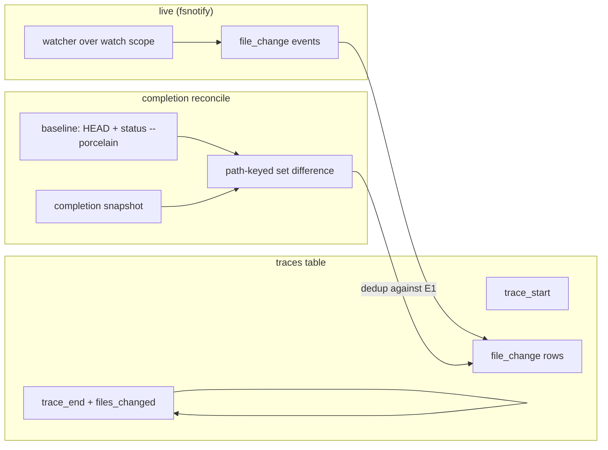

## Summary

Loom records the files a coding agent changes during a card session as `file_change` trace events. Recording combines a **live fsnotify watcher** (while a loom process is alive) with a **git-baseline reconciliation** on completion (so a tmux session that outlives loom is still attributed). Every open→complete cycle is a *run* with its own `run_id`; events are totally ordered by `traces.seq`. Spec: ADR-001 §3.3, §4.6, §5; `internal/trace` in DESIGN-002 §4.2.

## Diagram

## Key components

- **Watch scope** — the card's `codebase_id` path if set, else the workspace `root_path` (ADR-001 §4.6). Bounded watching; `file_change.path` is stored relative to it. See [watch-scope](../concepts/watch-scope.md).
- **fsnotify watcher** — registered per-directory (fsnotify isn't recursive); `Create` events add watches on the fly; ignore rules (built-in `.git`/`node_modules`/`target`/`dist`/`build`/`vendor`/`.venv`/`__pycache__` + `.loomignore` patterns) skip directories and prevent compiler/VCS noise.
- **Run lifecycle** — `trace_start` (with git baseline snapshot), `file_change` events, `trace_end` (with `duration_ms` + `files_changed` count of unique paths). All events for one cycle share a `run_id` (see [run](../concepts/run.md)).
- **Git reconciliation** — on `trace_start`, snapshot a baseline pair (`git rev-parse HEAD` + `git status --porcelain`); on completion, take a second pair and compute the authoritative change set, **keyed on path**, not on the raw porcelain line (ADR-001 §5). The baseline snapshot + reconcile logic landed in T8 (`SnapshotBaseline`, `Reconcile`, `Dedup`, `FilesChanged` in `internal/trace/git.go`); the recorder/watcher wiring that uses them is T9. See [git-reconciliation](../concepts/git-reconciliation.md).
- **`TraceRecorder`** — records events, owns the watcher, runs the reconcile; `trace` package imports `store` only (DESIGN-002 §4.2).

## Design decisions

| Decision | Rationale |
|---|---|
| Path-keyed porcelain diff (not line-wise) | A status-letter change alone is not an edit; a file already dirty at baseline yields a byte-identical line and vanishes. Deliberately biased toward over-attribution | ADR-001 §5 |
| Union of live fsnotify + git reconcile, deduped on path | fsnotify only records while a loom process is alive; reconcile covers sessions that outlive loom; a path is never counted twice | ADR-001 §5 |
| `run_id` on every trace event | Lets the card-detail view compute "Files Changed (last session)" and per-run duration | ADR-001 §3.3 |
| Partial UNIQUE index on `(card_id, run_id, event_type)` for `trace_start`/`trace_end` | Closes the double-Enter double-run race | ADR-001 §3.3 |
| `files_changed` counts unique paths | Computable per run for the detail view | ADR-001 §3.3 |

## Related

- [Architecture Overview](./overview.md) · [Session Model](./session-model.md) · [Data Model](./data-model.md)
- Concepts: [run](../concepts/run.md) · [trace-events](../concepts/trace-events.md) · [watch-scope](../concepts/watch-scope.md) · [git-reconciliation](../concepts/git-reconciliation.md)
- Flows: [Trace reconciliation](../flows/trace-reconciliation.md) · [Failure paths](../flows/failure-paths.md)
