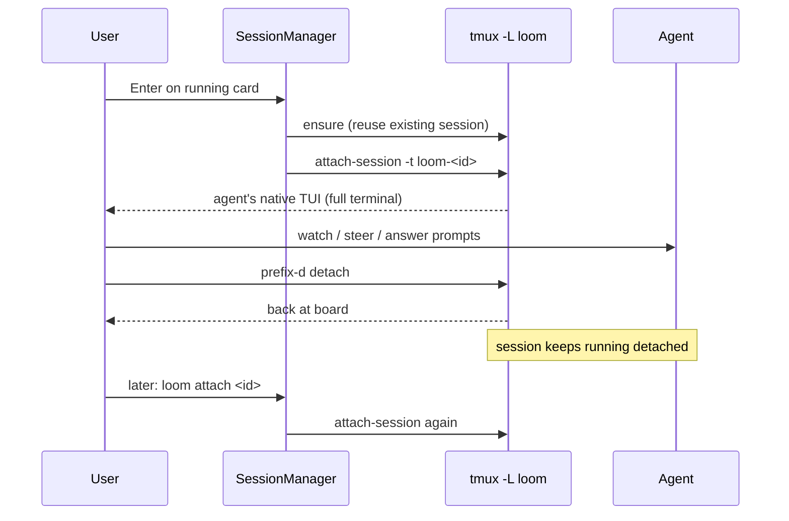

## Summary

The agent picks up the task in a background session; the human is **in the loop by choice**. Attach to watch, steer, answer permission prompts, or interrupt; detach to let it run while the board stays usable. The session survives loom exiting entirely. Spec: ADR-001 §4.3–§4.4.

## Trigger

- `Enter`/`loom card open <id>` on a running card (reattach), or `loom attach <id>`.
- Detach via `prefix d` (default `C-a d` on the loom server).

## Sequence diagram

## Steps

1. `ensure` reuses an existing session if present (no new run).
2. `tea.ExecProcess("tmux", ["-L","loom","attach-session","-t","loom-<id>"])` — the lazygit-pattern full-terminal handoff; the child is the tmux client.
3. On detach (`prefix d`), loom's board returns; the session keeps running.
4. If loom exits entirely, the session persists — a later loom invocation redisovers `loom-*` sessions and marks those cards running (ADR-001 §4.4).
5. When the user quits the agent (or `K`/`close`/done-move kills it), the session ends and the run finalizes.

## Failure modes

- **Nested tmux** — loom inside the user's own tmux: attach works nested; the loom server remaps prefix to `C-a` so nested keybindings don't collide (ADR-001 §4.4).
- **Agent left running and forgotten** — visible via `loom sessions`, board `●` markers, or `tmux -L loom ls`; kill with `K`/`loom card close <id>`.
- **Detached prefill regression** (future opencode): a `--detach` run could idle at its prompt as a live-but-empty run — the auto-submit canary guards this (DESIGN-002 §16).

## Related

- Architecture: [Session Model](../architecture/session-model.md)
- Concepts: [session](../concepts/session.md) · [run](../concepts/run.md)
- Flows: [Card open → completion](./card-open-complete.md)
