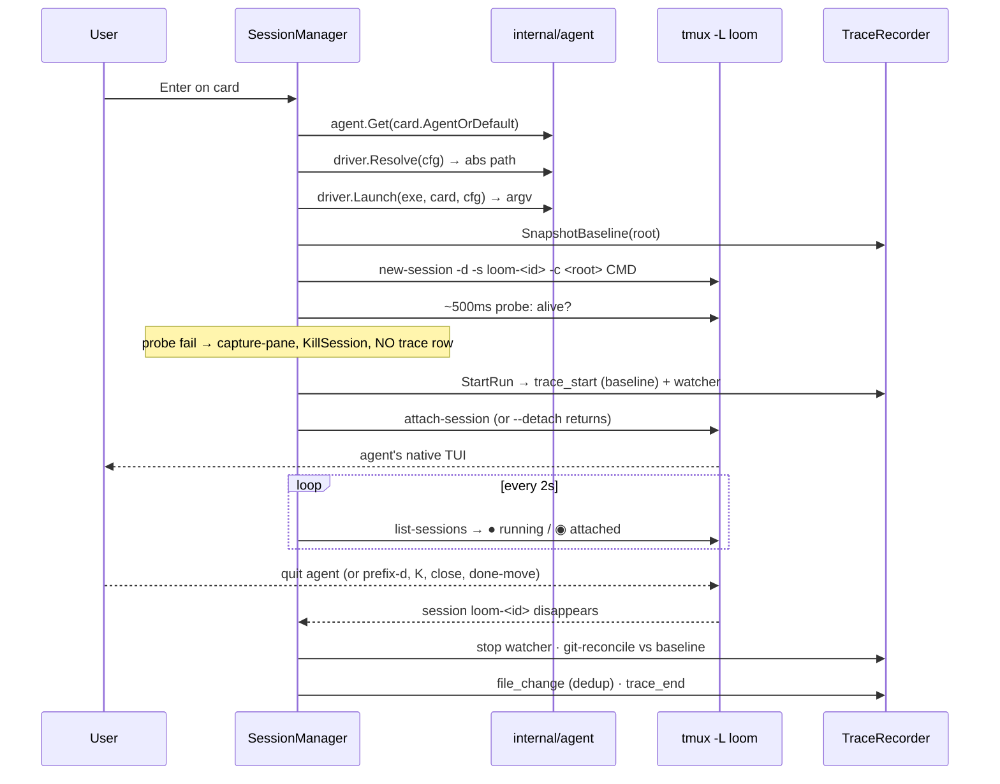

## Summary

The primary loop: **board → card → agent session → trace**. Opening a card is the launch. The agent runs in a detached `-L loom` session; completion is detected when the session disappears; a *run* (one open→complete cycle) is traced end-to-end. Agent-agnostic across claude/opencode. Spec: ADR-001 §3.2, §4; DESIGN-002 §10.

## Trigger

- `Enter` on a card in the [TUI](../modules/tui.md) — shipped T17: ensure via `BoardService.OpenCard(ctx, id, detach=true)`, then hand the TTY to `session.AttachCommandFor` (the attach handoff: `link-window`/`select-window` into the enclosing tmux when loom runs inside one, `attach-session` standalone) through `tea.ExecProcess` (the board restores on detach) — or `loom card open <id>` (interactive) / `loom card open <id> --detach` (scriptable).

## Sequence diagram

## Steps

1. **Resolve** — `exec.LookPath` the agent binary in loom's env; fail the open on error (no `trace_start`).
2. **Launch** — driver builds argv; every element POSIX single-quoted (`$SHELL -c`).
3. **Snapshot baseline** — git HEAD + porcelain (held, not yet written).
4. **Create session** — `new-session -d -s loom-<id> -c <root>`.
5. **Probe** (~500ms) — if the session is already gone, capture-pane, kill, and delete (not finalize) — a failed launch never appears as a completed run.
6. **Record** — `StartRun` writes `trace_start` + starts the fsnotify watcher (run recorded **after** probe; DESIGN-002 §10.2).
7. **SendKeys** (if set; `""` for both shipped drivers) after the probe.
8. **Attach** (via `AttachCommand`: a linked tab inside the user's tmux, else `attach-session`) or `--detach`; user steers/answers prompts; poll drives markers.
9. **Complete** — session vanishes → stop watcher, git-reconcile, emit missing `file_change`, write `trace_end`.

## Failure modes

- **Bad binary / bad cwd**: probe fails → captured pane surfaced as error toast, session killed, **no** `trace_start` row (C7; ADR-001 §4.1).
- **Missed completion** (run ends between 2s polls, or while loom isn't running): reconcile-on-startup finalizes it exactly once.
- **Post-create error** (e.g. `StartRun` fails): deferred `KillSession` + `AbortRun` leave no live session and no trace rows (DESIGN-002 §10.2 invariants).
- **Double-Enter race**: partial UNIQUE index on `(card_id, run_id, event_type)` for `trace_start`/`trace_end` prevents two concurrent runs.
- **opencode prefill regression** (future): the auto-submit canary fails a test instead of silently idling a `--detach` run (DESIGN-002 §16).

## Related

- Architecture: [Session Model](../architecture/session-model.md) · [Agent Abstraction](../architecture/agent-abstraction.md) · [Trace Recording](../architecture/trace-recording.md)
- Concepts: [run](../concepts/run.md) · [session](../concepts/session.md) · [agent-driver](../concepts/agent-driver.md)
- Flows: [Attach/detach](./attach-detach.md) · [Failure paths](./failure-paths.md) · [Trace reconciliation](./trace-reconciliation.md)
